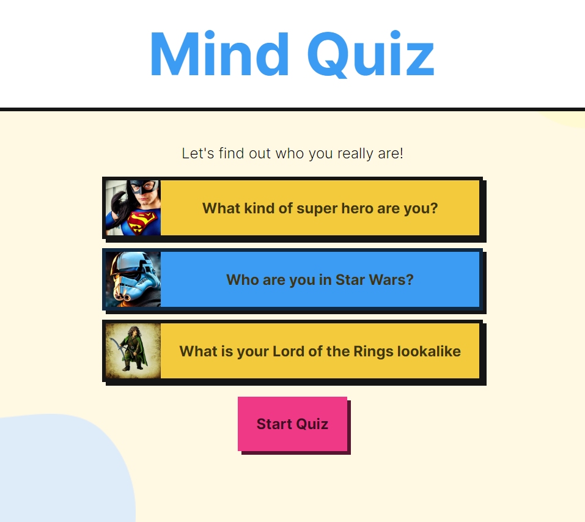

# react-psycho-test

Psychology test with results based on majority of answers by type.
The project is using React, coded in TypeScript, on a vite@js base. It uses Framer motion for animations. The data is coming from a json file. The images and texts were generated by AI.

🔗 **Live preview:** [here](https://spectacular-alfajores-5af175.netlify.app/)

### Screenshot

## Built with

### Technologies

- TypeScript
- React JS
- HTML
- CSS

### Tools

- Vite
- react-scroll
- Framer motion

## Features

- A selection of quizzes
- Each quiz has X questions with 4 answers corresponing to 4 categories
- At the end of the quiz, you get a personalize result based on your answers
- Points assigned to each category can be edited in the json file for each quiz

## What I learned

- Better knowledge of TypeScript
- Use of framer motion
- AI data generation.

## Author

👤 **Edouard Desgrée**

- GitHub: [edesgree](https://github.com/edesgree)
